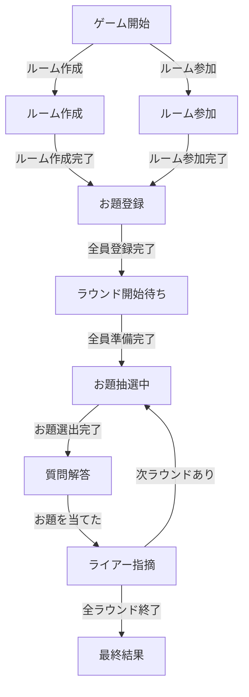

## ゲーム企画概要：生成AIを活用した推理・駆け引きゲーム

### ゲームタイトル案
「ライアークエスチョン」または「AIミステリークイズ」

### ゲームの概要
* 生成AIを活用した推理ゲーム
  ユーザーが生成AI（RAG）に質問を投げ、AIの回答を元にお題を推測する。
* 「アキネーターの逆」形式  
  プレイヤー自身が質問を重ねてお題を絞り込むプロセスを楽しむ。
* 共通テーマによる推理サポート
  お題には共通テーマを設定し、推測の幅を適切に絞ることで楽しさを向上させる。

### プレイ人数
* 5人程度を想定。

### ゲームの特徴
1. お題推理の楽しさ
  プレイヤーが生成AIの回答を元に、お題を絞り込むプロセスが楽しい。
2. 駆け引きの醍醐味
  お題を考えたプレイヤー（ライアープレイヤー）が正体を隠すために工夫することで心理戦が生まれる。
3. ポイント争奪の白熱感
  お題の正解とライアープレイヤーの特定の両方でポイントを稼ぐため、戦略性が求められる。

### ゲーム進行手順

1. ルーム作成・参加
  * ルーム作成者がテーマと合言葉を設定する。
  * 他のプレイヤーは合言葉を入力してルームに参加する。

2. お題候補の登録
  * 各プレイヤーがお題候補を1つずつ秘密裏に登録する。
  * お題は設定されたテーマに沿ったものを登録する。
  （例：テーマが「動物」なら「犬」「ライオン」など）

3. お題のランダム選出
  * 登録されたお題候補から1つランダムにお題として選出。

4. 質問＆推測フェーズ（同時進行）
  * プレイヤーは順番に生成AIに質問を投げかけ、回答を得る。
  * 質問の途中でも、お題が分かったと思った時点で推測が可能。
  * 推測が的中した場合、その時点でフェーズが終了し、次の手順へ移行。

5. ライアープレイヤー推測フェーズ
  * お題を考えた「ライアープレイヤー」を推理。
  * 正解者にはさらにポイントが付与。

6. 次ラウンド開始
  * 全員のお題が順番に推測対象になるまで繰り返す。

7. 最終得点の集計
  * お題推測とライアープレイヤー推測で獲得したポイントを合計。
  * 最もポイントを多く稼いだプレイヤーが勝利！

### 勝負のポイント
* 質問のセンス
  効果的な質問でAIから有力な情報を引き出す能力が問われる。
* 心理戦の妙
  お題を考えたプレイヤーが自分の正体を隠しつつ、自然に振る舞う駆け引き。
* 協力と競争のバランス
  他のプレイヤーと協力して情報を引き出しながらも、最終的には勝利を目指す。

### ゲームの魅力
* 生成AIのユニークな活用で「新感覚の推理ゲーム」として楽しめる。
* お題の内容次第で幅広いテーマや難易度に対応可能。
* プレイヤー同士の交流や対話が盛り上がりやすい設計。

### テーマの説明
* テーマはお題に共通する概念や分類です。
* テーマを設けることで、お題の範囲が絞られ、推測が容易になります。
* ルーム作成者がテーマを設定します。
* テーマの例：「動物」「食べ物」「スポーツ選手」「映画」など

### あいことばの説明
* あいことばは、ゲームに参加するための合言葉です。
* プレイヤーが同じあいことばを入力することで、同じゲームに参加できます。
* あいことばはルーム作成時に設定され、他のプレイヤーと共有してください。

## シーン

### ルーム作成
* ルーム作成者がテーマを設定する。
* 合言葉を決める。
* プレイヤー名を入力する。

### ルーム参加
* 合言葉を入力してルームに参加する。
* プレイヤー名を入力する。

### お題登録
* 各プレイヤーが設定されたテーマに沿ったお題を登録する。
* お題は他のプレイヤーに見られないように秘密裏に登録する。
* プレイヤーが全員登録したら質問解答シーンへ移動する。

### ラウンド開始待ち
* 全員がお題登録を完了、もしくは答え合わせの確認を待つ。

### お題抽選中
* お題をランダムに選ばれる
* お題に関する情報を収集する

### 質問解答
* プレイヤーが登録したお題から1つランダムに選ぶ。
* プレイヤーは同時に生成AIに質問を投げかける。
* AIの回答を元にお題を推測する。
* お題を当てた場合は正答者にポイントが付与され、ライアープレイヤーを指摘シーンに移動する。
* 質問数、解答数には上限があり、上限に達したら自動的にライアープレイヤーを指摘シーンに移動する。

### ライアー指摘
* プレイヤーはライアープレイヤーを指摘する。
* 全員の指摘が終わったら、次のラウンドがある場合はお題抽選中シーンへ、次のラウンドがない場合は最終結果シーンへ移動する。

### 最終結果
* 全員のお題が推測されたら、最終結果を発表する。
* 各ラウンドのライアー指摘ポイントの集計を行う。
  * ライアープレイヤーを特定したプレイヤーにポイントを付与する。
  * 誰もお題を当てられなかった場合、お題を考えたライアープレイヤーのポイントを減らす。
* 各ラウンドの結果（お題、正解者、ライアープレイヤー）を表示する。
* 各プレイヤーの合計得点を表示する。
* 最も得点の高いプレイヤーが勝者となる。

## シーン遷移図

